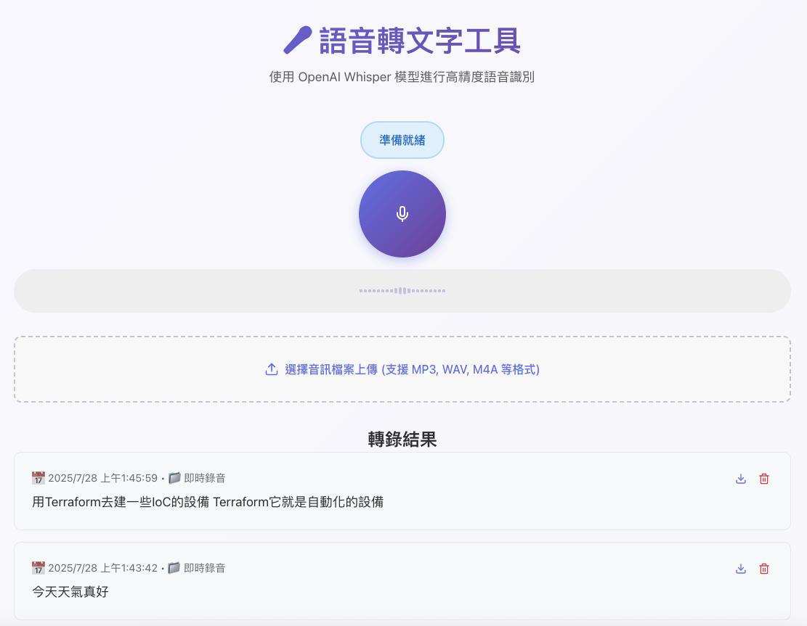

# 🎤 Speech-to-Text App

即時語音轉文字應用程式，使用 OpenAI Whisper 模型進行高精度語音識別

## 📸 應用程式預覽



## 📋 徽章


## 🌟 功能特點

- ✨ **即時語音錄製和轉換** - 點擊即可開始錄音，自動轉錄
- 🎵 **多種音訊格式支援** - MP3, WAV, M4A, WEBM 等
- 🤖 **OpenAI Whisper API** - 業界領先的語音識別精度
- 🎨 **現代化 React 界面** - 響應式設計，美觀易用
- ⚡ **高效能 FastAPI 後端** - 快速穩定的 API 服務
- 📊 **即時音訊可視化** - 錄音時的音頻波形顯示
- 💾 **結果下載功能** - 支援文本檔案匯出
- 🌐 **多語言支援** - 自動檢測語言類型

## 🏗️ 技術架構

- **前端**: React 18 + TypeScript + Vite
- **後端**: FastAPI + Python 3.13
- **語音識別**: OpenAI Whisper API
- **音訊處理**: Web Audio API
- **UI 組件**: Lucide React Icons
- **HTTP 客戶端**: Axios

## 📁 專案結構

```
speech-to-text-real-time/
├── 📁 frontend/              # React 前端應用
│   ├── 📁 src/
│   │   ├── 📁 components/    # React 組件
│   │   ├── 📁 hooks/         # 自定義 Hooks
│   │   ├── App.tsx           # 主應用程式
│   │   ├── api.ts            # API 客戶端
│   │   └── index.css         # 樣式檔案
│   ├── package.json          # 前端依賴
│   └── vite.config.ts        # Vite 配置
├── 📁 backend/               # FastAPI 後端服務
│   ├── main.py               # FastAPI 應用程式
│   ├── requirements.txt      # Python 依賴
│   ├── .env.example          # 環境變數範例
│   └── Dockerfile            # Docker 配置
├── docker-compose.yml        # Docker 容器編排
├── start.sh                  # 快速啟動腳本
└── README.md                 # 專案說明
```

## 🚀 完整安裝和啟動指南

### 📋 系統要求

- **作業系統**: macOS, Linux, Windows
- **Node.js**: 18.0+ (建議使用 LTS 版本)
- **Python**: 3.8+ (測試環境使用 3.13)
- **OpenAI API Key**: 需要有效的 API 金鑰

### 🔧 環境檢查

首先確認您的系統環境：

```bash
# 檢查 Node.js 版本
node --version

# 檢查 Python 版本
python3 --version

# 檢查 npm 版本
npm --version
```

### 📦 專案安裝

#### 1. 克隆專案

```bash
git clone https://github.com/YIFUNLIN/speech-to-text-real-time.git
cd speech-to-text-real-time
```

#### 2. 設定 OpenAI API Key

```bash
# 複製環境變數範例檔案
cp backend/.env.example backend/.env

# 編輯 .env 檔案，將您的 OpenAI API Key 替換
# OPENAI_API_KEY=your_actual_api_key_here
```

> 💡 **獲取 API Key**: 訪問 [OpenAI Platform](https://platform.openai.com/api-keys) 創建您的 API Key

### 🔨 後端設置和啟動

#### 1. 進入後端目錄

```bash
cd backend
```

#### 2. 創建 Python 虛擬環境

```bash
# 創建虛擬環境
python3 -m venv venv

# 啟動虛擬環境 (macOS/Linux)
source venv/bin/activate

# 或在 Windows 上
# venv\Scripts\activate
```

#### 3. 安裝 Python 依賴

```bash
pip install -r requirements.txt
```

#### 4. 啟動後端服務

```bash
# 方法 1: 使用虛擬環境 (推薦)
source venv/bin/activate
uvicorn main:app --reload --host 0.0.0.0 --port 8000

# 方法 2: 如果虛擬環境有問題，使用完整路徑
export PYTHONPATH="$(pwd)/venv/lib/python3.13/site-packages:$PYTHONPATH"
/opt/homebrew/opt/python@3.13/bin/python3.13 -m uvicorn main:app --reload --host 0.0.0.0 --port 8000 --app-dir .
```

#### 5. 驗證後端服務

打開瀏覽器訪問：
- **健康檢查**: http://localhost:8000/health
- **API 文檔**: http://localhost:8000/docs
- **基本端點**: http://localhost:8000/

### 💻 前端設置和啟動

#### 1. 開啟新終端並進入前端目錄

```bash
cd frontend
```

#### 2. 安裝 Node.js 依賴

```bash
npm install
```

#### 3. 啟動前端開發伺服器

```bash
npm run dev
```

#### 4. 驗證前端服務

前端服務將在 http://localhost:5173 啟動

### 🎯 使用應用程式

1. **開啟瀏覽器**: 訪問 http://localhost:5173
2. **即時錄音**:
   - 點擊麥克風按鈕開始錄音
   - 允許瀏覽器存取麥克風權限
   - 再次點擊停止錄音並自動轉錄
3. **檔案上傳**:
   - 點擊上傳區域選擇音訊檔案
   - 支援 MP3, WAV, M4A, WEBM 等格式
   - 自動處理並顯示轉錄結果
4. **下載結果**: 點擊下載按鈕儲存轉錄文本

## 🔄 重新啟動專案指南

**⚠️ 重要**: 一旦完成上述完整安裝後，以後每次重新啟動專案時，只需要執行以下簡化步驟：

### 快速啟動步驟

#### 1. 啟動後端服務

```bash
# 進入專案根目錄
cd /path/to/speech-to-text-real-time

# 進入後端目錄並啟動虛擬環境
cd backend
source venv/bin/activate

# 啟動後端服務
uvicorn main:app --reload --host 0.0.0.0 --port 8000
```

如果虛擬環境啟動有問題，可以使用替代方法：
```bash
# 替代啟動方法
. venv/bin/activate
# 或直接使用
python main.py
```

#### 2. 啟動前端服務 (新終端視窗)

```bash
# 在新終端視窗中，進入前端目錄
cd /path/to/speech-to-text-real-time/frontend

# 啟動前端開發伺服器
npm run dev
```

#### 3. 驗證服務運行

- **前端應用**: http://localhost:5173
- **後端 API**: http://localhost:8000
- **API 文檔**: http://localhost:8000/docs
- **後端健康檢查**: http://localhost:8000/health

### 💡 啟動提示

- **環境變數**: `.env` 文件已設置，無需重新配置
- **依賴套件**: 虛擬環境和 `node_modules` 已安裝，無需重新安裝
- **服務順序**: 建議先啟動後端，再啟動前端
- **停止服務**: 在終端中按 `Ctrl+C` 停止服務

### 🔧 如果遇到啟動問題

```bash
# 檢查端口是否被占用
lsof -ti:8000 | xargs kill -9  # 停止後端端口
lsof -ti:5173 | xargs kill -9  # 停止前端端口

# 重新啟動虛擬環境
cd backend
deactivate  # 如果已啟動
source venv/bin/activate
```

## 🐳 Docker 快速啟動 (可選)

如果您偏好使用 Docker：

```bash
# 設定環境變數
cp backend/.env.example backend/.env
# 編輯 backend/.env 添加您的 OpenAI API Key

# 啟動所有服務
docker-compose up --build

# 服務地址：
# 前端: http://localhost:3000
# 後端: http://localhost:8000
```

## 🛠️ 故障排除

### 常見問題

#### Python 虛擬環境問題
```bash
# 如果 source 命令無效，嘗試使用 . 命令
. venv/bin/activate

# 或直接使用虛擬環境中的 Python
./venv/bin/python -m uvicorn main:app --reload
```

#### 端口被占用
```bash
# 檢查端口使用情況
lsof -ti:8000 | xargs kill -9  # 停止 8000 端口服務
lsof -ti:5173 | xargs kill -9  # 停止 5173 端口服務
```

#### 麥克風權限問題
- 確保瀏覽器有麥克風存取權限
- 在 HTTPS 環境下使用 (localhost 除外)
- 檢查系統麥克風設定

#### OpenAI API 問題
- 確認 API Key 正確且有效
- 檢查 API 使用配額
- 確認網路連接正常

### 開發模式 vs 生產模式

#### 開發模式 (當前配置)
- 後端: http://localhost:8000 (支援熱重載)
- 前端: http://localhost:5173 (Vite 開發伺服器)

#### 生產部署
```bash
# 構建前端
cd frontend
npm run build

# 前端檔案將在 dist/ 目錄中
# 可以使用 Nginx 或其他網頁伺服器提供服務
```

## 📊 API 文檔

### 主要端點

- `GET /` - 根路徑健康檢查
- `GET /health` - 服務健康狀態
- `POST /transcribe` - 完整音訊檔案轉錄
- `POST /transcribe-realtime` - 即時音訊片段轉錄

詳細 API 文檔：http://localhost:8000/docs

## 🤝 貢獻指南

歡迎提交 Issues 和 Pull Requests！

1. Fork 專案
2. 創建功能分支 (`git checkout -b feature/AmazingFeature`)
3. 提交變更 (`git commit -m 'Add some AmazingFeature'`)
4. 推送到分支 (`git push origin feature/AmazingFeature`)
5. 開啟 Pull Request

## 📄 授權

此專案基於 MIT 授權 - 詳見 [LICENSE](LICENSE) 檔案

## 🙏 致謝

- [OpenAI Whisper](https://openai.com/research/whisper) - 強大的語音識別模型
- [FastAPI](https://fastapi.tiangolo.com/) - 現代化的 Python Web 框架
- [React](https://reactjs.org/) - 用戶界面建構庫
- [Vite](https://vitejs.dev/) - 快速的前端建置工具

---

如果您覺得這個專案有用，請給它一個 ⭐️！
